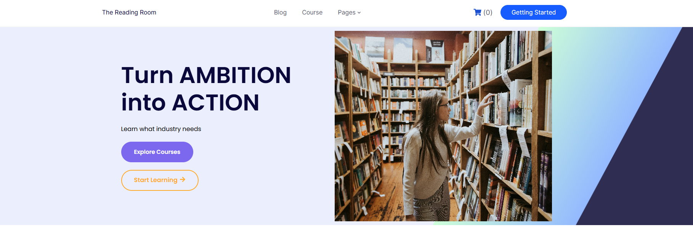
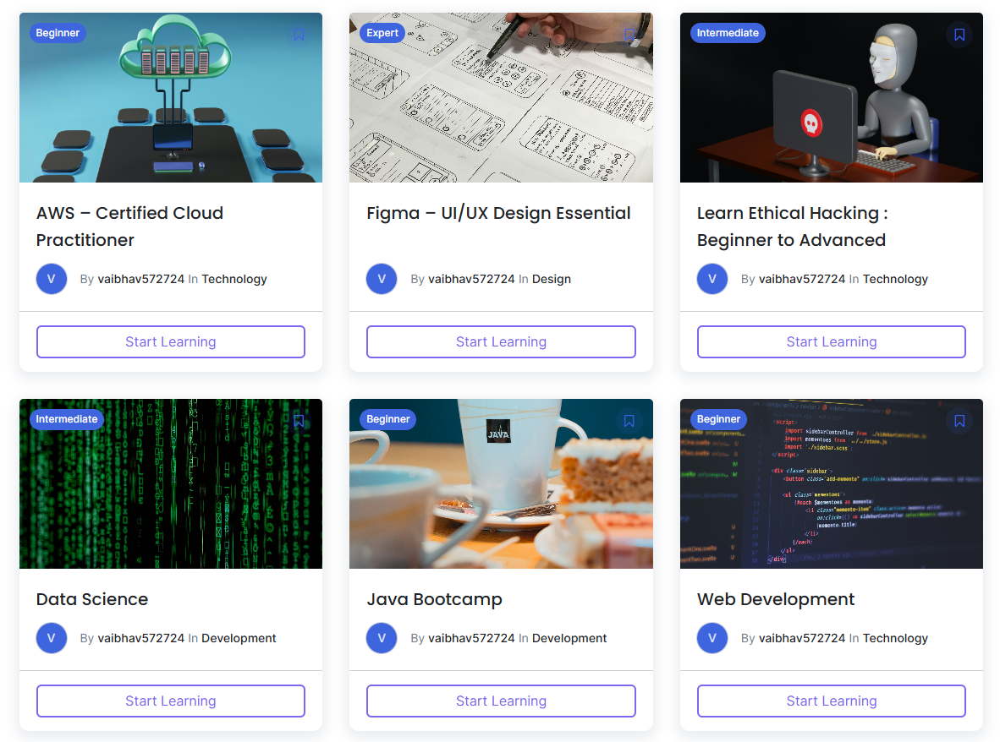
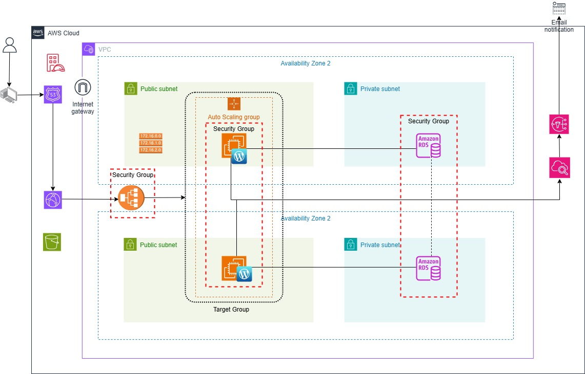

# AWS_Capstone_Project

## **📌 Description**
This repository contains the Terraform scripts used to provision and manage the infrastructure for a highly available, scalable, and secure WordPress-based Learning Management System (LMS) on Amazon Web Services (AWS). The scripts automate the deployment of a three-tier architecture, encompassing networking (VPC, subnets, route tables), compute (EC2 instances, Auto Scaling Group), load balancing (Application Load Balancer), database (RDS MariaDB), DNS management (Route 53), and content delivery (CloudFront). The Terraform code is designed for modularity and reusability, enabling consistent and repeatable deployments of the LMS infrastructure.
A glimpse of the deployed LMS webpage can be seen in the images below, showcasing a user-friendly interface with readily accessible courses and intuitive navigation, providing a foundation for effective online learning.

## **🏗️ System Infrastructure/Topology Diagram**

The architecture diagram illustrates the AWS resources employed to host the WordPress-based LMS.

The architecture utilizes the following key AWS resources:

- **Virtual Private Cloud (VPC):** Provides a logically isolated network for the LMS infrastructure.
- **Public and Private Subnets:** Enable network segmentation and control access to resources.
- **Internet Gateway:** Allows communication between the VPC and the internet.
- **Route Tables:** Manage network traffic routing within the VPC.
- **Auto Scaling Group (ASG):** Automatically adjusts the number of EC2 instances based on traffic demand.
- **EC2 Instances:** Host the WordPress application.
- **Application Load Balancer (ALB):** Distributes incoming traffic across multiple EC2 instances.
- **Target Group:** Defines the group of EC2 instances that the ALB routes traffic to.
- **RDS MariaDB:** Provides a managed database service for storing LMS data.
- **Security Groups:** Control network access to EC2 instances and the RDS database.
